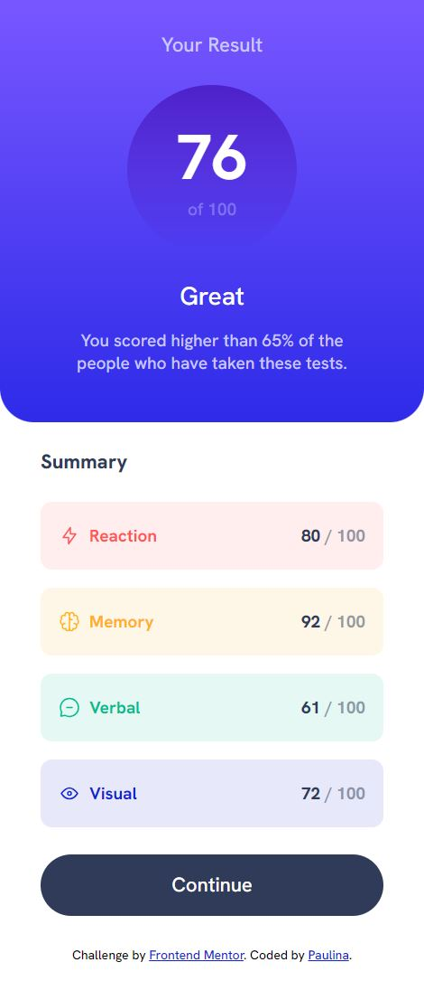
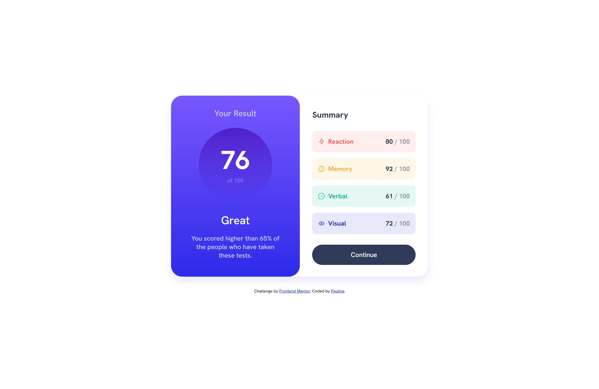

# Frontend Mentor - Results summary component solution

This is a solution to the [Results summary component challenge on Frontend Mentor](https://www.frontendmentor.io/challenges/results-summary-component-CE_K6s0maV). 

## Table of contents

- [Overview](#overview)
  - [The challenge](#the-challenge)
  - [Screenshots](#screenshots)
  - [Link](#link)
- [My process](#my-process)
  - [Design](#design)
  - [Development](#development)
  - [Built with](#built-with)
  - [What I learned](#what-i-learned)

## Overview
This project represents a test result summary component. It fetches data from a JSON file that includes a user's scores in different categories. These scores are then displayed on the page, along with a visual representation of the user's overall score out of 100. The content of the page is initially off the screen and slides into view when the page is loaded.

### The challenge

Users should be able to:

- View the optimal layout for the interface depending on their device's screen size
- See hover and focus states for all interactive elements on the page

### Screenshots

### Link

- Live Site URL: [Add live site URL here](https://your-live-site-url.com)

## My process

### Design
I was given a user-friendly and clear design for this project by Frontend Mentor. My task was to recreate and bring this design to life using HTML, CSS, and optionally, JavaScript.

### Development
The development process involved building the HTML structure of the page, styling it with CSS, and then adding functionality with JavaScript. The data for the page is fetched from a JSON file, which allows for easy updating and management of the test scores.

### Built with

- Semantic HTML5 markup
- CSS custom properties
- Flexbox
- CSS Grid
- Mobile-first workflow
- JavaScript
- Fetch API

### What I learned

Throughout this project, I've improved my skills in handling asynchronous operations in JavaScript with the Fetch API. Moreover, I learned how to manipulate the DOM dynamically based on the data fetched from the JSON file. The project also helped me practice using CSS animations to make the content slide into the screen when the page is loaded, providing a more engaging user experience. I have also reinforced my skills in responsive design, making sure the page looks and works well across a variety of screen sizes. Finally, I have successfully applied the concept of CSS variables to manage color schemes and font sizes effectively, which made the process of developing the page more efficient. 

